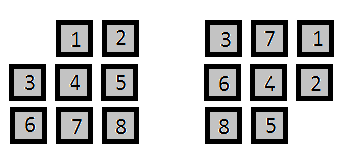

# Block-Puzzle
C# implementation of solving the following puzzle:

<b>Objective</b>: List the steps to restore the puzzle from the right to the left below
 Each step can only move a block up, down, left or right if it is allowed. 
 For example, the first move could only be either 5 to the right or 2 to the below.

See if you can solve the puzzle yourself:
 <a target="_blank">http://csprojects.me/blockPuzzle/</a>

Implementation notes:
- Solves the given puzzle almost instantaneously, ~30ms
- Can specifiy any initial and target configuration of the puzzle board to solve
- Solution to the example above as outputted by the program:
<pre>
Step 1: Move 5 right
Step 2: Move 8 right
Step 3: Move 6 down
Step 4: Move 4 left
Step 5: Move 7 down
Step 6: Move 1 left
Step 7: Move 2 up
Step 8: Move 5 up
Step 9: Move 8 right
Step 10: Move 7 down
Step 11: Move 4 right
Step 12: Move 3 down
</pre>
